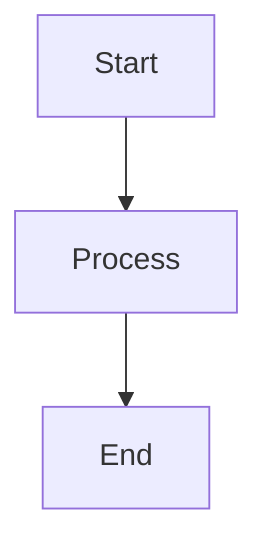

# Template

DocTools ships with the **WaynGames.StaticToc.Extension** template, which extends DocFX's built-in `statictoc` template with custom styling, interactive features, and accessibility support.

## Features

| Feature | Description |
|---------|-------------|
| **Dark / light mode** | Toggle button in the navbar. Persists choice in `localStorage` and respects OS `prefers-color-scheme` on first visit |
| **Version switcher** | Dropdown in the breadcrumb bar populated from `versions.js`. Navigates between version builds |
| **Language switcher** | Dropdown in the breadcrumb bar populated from `languages.js`. Appears when more than one language is built. Falls back to English if target language unavailable |
| **Mermaid diagrams** | Mermaid v11.11.0 with SVG Toolbelt for zoom/pan. Use fenced code blocks with the `mermaid` language tag |
| **Syntax highlighting** | Highlight.js with .NET Config language support |
| **Full-text search** | Built-in DocFX search with cross-package search support |
| **WCAG AA accessibility** | All color combinations meet 4.5:1 contrast for text and 3:1 for UI |
| **Responsive layout** | Sidebar collapses on narrow viewports |
| **Print stylesheet** | Hides navigation, expands content for printing |
| **Reduced motion** | Transitions removed when `prefers-reduced-motion: reduce` is active |
| **High contrast** | Supports Windows High Contrast mode via `forced-colors: active` |

## File Structure

```
templates/WaynGames.StaticToc.Extension/
├── partials/
│   ├── head.tmpl.partial           # Theme init, fonts, analytics, favicon
│   ├── navbar.tmpl.partial         # Top nav with logo, search, dark mode toggle
│   ├── breadcrumb.tmpl.partial     # Version/language switcher + breadcrumbs
│   └── scripts.tmpl.partial        # JS: versions, languages, theme, Mermaid, search
└── styles/
    ├── main.css                    # Full theme (light + dark) and layout
    ├── version-switcher.css        # Version dropdown styling
    ├── language-switcher.css       # Language dropdown styling
    └── cross-search.js            # Cross-package search
```

The template overrides specific DocFX partials while inheriting everything else from `statictoc`. DocFX merges templates in order, so only the four partials listed above are replaced.

## Theme System

The theme uses CSS custom properties for all colors, applied via a `data-theme` attribute on `<html>`.

### How It Works

1. On page load, an inline script in `head.tmpl.partial` checks `localStorage` for a saved theme preference
2. If none exists, it uses the OS preference via `prefers-color-scheme`
3. The navbar toggle button switches between `"dark"` and `"light"` and saves the choice
4. OS-level theme changes are detected in real time and applied if no manual override exists

### Color Palette

**Light mode** (default):

| Variable | Color | Contrast | Purpose |
|----------|-------|----------|---------|
| `--primary` | `#2968A8` | 4.7:1 | Links, buttons |
| `--accent` | `#C58400` | 4.6:1 | Highlights |
| `--ink` | `#1A1A1A` | 16:1 | Body text |
| `--page-bg` | `#FFFFFF` | — | Background |

**Dark mode**:

| Variable | Color | Contrast | Purpose |
|----------|-------|----------|---------|
| `--primary` | `#5BA3E6` | 5.2:1 | Links, buttons |
| `--accent` | `#E9A84C` | 6.5:1 | Highlights |
| `--ink` | `#E0E0E0` | 13:1 | Body text |
| `--page-bg` | `#1E1E1E` | — | Background |

Both themes include semantic colors for warnings (`--warning`), success (`--success`), and alerts.

## Mermaid Diagrams

Use fenced code blocks with the `mermaid` language tag:

````markdown

````

Diagrams are rendered as interactive SVGs with zoom, pan, and download controls via SVG Toolbelt. Controls appear on hover to avoid obscuring the diagram.

Mermaid v11.11.0 is bundled — no CDN dependency.

## Cross-Package Search

When multiple packages are hosted on the same domain (e.g., `docs.wayn.games`), the search box can search across all packages. This requires a `packages.json` manifest at the site root listing all package paths.

Results show the package name as a badge and link to the matching page in the other package's docs.

## Alerts and Callouts

DocFX supports GitHub-flavored alert syntax:

```markdown
> [!NOTE]
> This is a note.

> [!WARNING]
> This is a warning.

> [!IMPORTANT]
> This is important.

> [!TIP]
> This is a tip.
```

Each alert type has a distinct icon and color in both light and dark modes.

## How It Extends statictoc

The template overrides four partials while inheriting all other `statictoc` behavior (TOC rendering, search index generation, content layout). The build pipeline automatically resolves the template path and passes both `statictoc` and the extension to `docfx build`:

```json
"template": ["statictoc", "/path/to/WaynGames.StaticToc.Extension"]
```

## Next Steps

- [Configuration](configuration.md) — Settings that affect the template
- [Best Practices](best-practices.md) — Using Mermaid diagrams and alerts effectively
- [Troubleshooting](troubleshooting.md) — Common template issues
