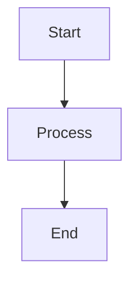

# Template

DocTools est livr avec le template **WaynGames.StaticToc.Extension**, qui tend le template `statictoc` intgr de DocFX avec des styles personnaliss, des fonctionnalits interactives et un support de l'accessibilit.

## Fonctionnalits

| Fonctionnalit | Description |
|---------|-------------|
| **Mode sombre / clair** | Bouton bascule dans la barre de navigation. Persiste le choix dans `localStorage` et respecte le `prefers-color-scheme` du systme d'exploitation lors de la premire visite |
| **Slecteur de version** | Menu droulant dans la barre de fil d'Ariane aliment par `versions.js`. Permet de naviguer entre les builds de versions |
| **Slecteur de langue** | Menu droulant dans la barre de fil d'Ariane aliment par `languages.js`. Apparat lorsque plus d'une langue est gnre. Revient  l'anglais si la langue cible n'est pas disponible |
| **Diagrammes Mermaid** | Mermaid v11.11.0 avec SVG Toolbelt pour le zoom/dfilement. Utilisez des blocs de code dlimits avec le tag de langage `mermaid` |
| **Coloration syntaxique** | Highlight.js avec support du langage .NET Config |
| **Recherche plein texte** | Recherche DocFX intgre avec support de recherche inter-packages |
| **Accessibilit WCAG AA** | Toutes les combinaisons de couleurs respectent un contraste de 4.5:1 pour le texte et de 3:1 pour l'interface |
| **Mise en page responsive** | La barre latrale se replie sur les crans troits |
| **Feuille de style d'impression** | Masque la navigation, tend le contenu pour l'impression |
| **Mouvement rduit** | Les transitions sont supprimes lorsque `prefers-reduced-motion: reduce` est actif |
| **Contraste lev** | Prend en charge le mode Contraste lev de Windows via `forced-colors: active` |

## Structure des fichiers

```
templates/WaynGames.StaticToc.Extension/
├── partials/
│   ├── head.tmpl.partial           # Initialisation du thme, polices, analytics, favicon
│   ├── navbar.tmpl.partial         # Navigation suprieure avec logo, recherche, bascule du mode sombre
│   ├── breadcrumb.tmpl.partial     # Slecteur de version/langue + fil d'Ariane
│   └── scripts.tmpl.partial        # JS : versions, langues, thme, Mermaid, recherche
└── styles/
    ├── main.css                    # Thme complet (clair + sombre) et mise en page
    ├── version-switcher.css        # Style du menu droulant de version
    ├── language-switcher.css       # Style du menu droulant de langue
    └── cross-search.js            # Recherche inter-packages
```

Le template surcharge des partials DocFX spcifiques tout en hritant de tout le reste de `statictoc`. DocFX fusionne les templates dans l'ordre, donc seuls les quatre partials lists ci-dessus sont remplacs.

## Systme de thme

Le thme utilise des proprits personnalises CSS pour toutes les couleurs, appliques via un attribut `data-theme` sur `<html>`.

### Fonctionnement

1. Au chargement de la page, un script en ligne dans `head.tmpl.partial` vrifie dans `localStorage` s'il existe une prfrence de thme enregistre
2. Si aucune n'existe, il utilise la prfrence du systme d'exploitation via `prefers-color-scheme`
3. Le bouton bascule de la barre de navigation alterne entre `"dark"` et `"light"` et enregistre le choix
4. Les changements de thme au niveau du systme d'exploitation sont dtects en temps rel et appliqus si aucun choix manuel n'existe

### Palette de couleurs

**Mode clair** (par dfaut) :

| Variable | Couleur | Contraste | Utilisation |
|----------|-------|----------|---------|
| `--primary` | `#2968A8` | 4.7:1 | Liens, boutons |
| `--accent` | `#C58400` | 4.6:1 | Mises en vidence |
| `--ink` | `#1A1A1A` | 16:1 | Texte principal |
| `--page-bg` | `#FFFFFF` | — | Arrire-plan |

**Mode sombre** :

| Variable | Couleur | Contraste | Utilisation |
|----------|-------|----------|---------|
| `--primary` | `#5BA3E6` | 5.2:1 | Liens, boutons |
| `--accent` | `#E9A84C` | 6.5:1 | Mises en vidence |
| `--ink` | `#E0E0E0` | 13:1 | Texte principal |
| `--page-bg` | `#1E1E1E` | — | Arrire-plan |

Les deux thmes incluent des couleurs smantiques pour les avertissements (`--warning`), les succs (`--success`) et les alertes.

## Diagrammes Mermaid

Utilisez des blocs de code dlimits avec le tag de langage `mermaid` :

````markdown

````

Les diagrammes sont rendus sous forme de SVG interactifs avec des contrles de zoom, de dfilement et de tlchargement via SVG Toolbelt. Les contrles apparaissent au survol pour ne pas masquer le diagramme.

Mermaid v11.11.0 est inclus — aucune dpendance CDN.

## Recherche inter-packages

Lorsque plusieurs packages sont hbergs sur le mme domaine (par exemple, `docs.wayn.games`), la bote de recherche peut effectuer des recherches dans tous les packages. Cela ncessite un manifeste `packages.json`  la racine du site listant tous les chemins de packages.

Les rsultats affichent le nom du package sous forme de badge et renvoient vers la page correspondante dans la documentation de l'autre package.

## Alertes et encadrs

DocFX prend en charge la syntaxe d'alerte  la GitHub :

```markdown
> [!NOTE]
> Ceci est une note.

> [!WARNING]
> Ceci est un avertissement.

> [!IMPORTANT]
> Ceci est important.

> [!TIP]
> Ceci est une astuce.
```

Chaque type d'alerte possde une icne et une couleur distinctes dans les modes clair et sombre.

## Comment il tend statictoc

Le template surcharge quatre partials tout en hritant de tous les autres comportements de `statictoc` (rendu de la table des matires, gnration de l'index de recherche, mise en page du contenu). Le pipeline de build rsout automatiquement le chemin du template et transmet  la fois `statictoc` et l'extension  `docfx build` :

```json
"template": ["statictoc", "/path/to/WaynGames.StaticToc.Extension"]
```

## Prochaines tapes

- [Configuration](configuration.md) — Paramtres affectant le template
- [Bonnes pratiques](best-practices.md) — Utiliser efficacement les diagrammes Mermaid et les alertes
- [Dpannage](troubleshooting.md) — Problmes courants lis au template
